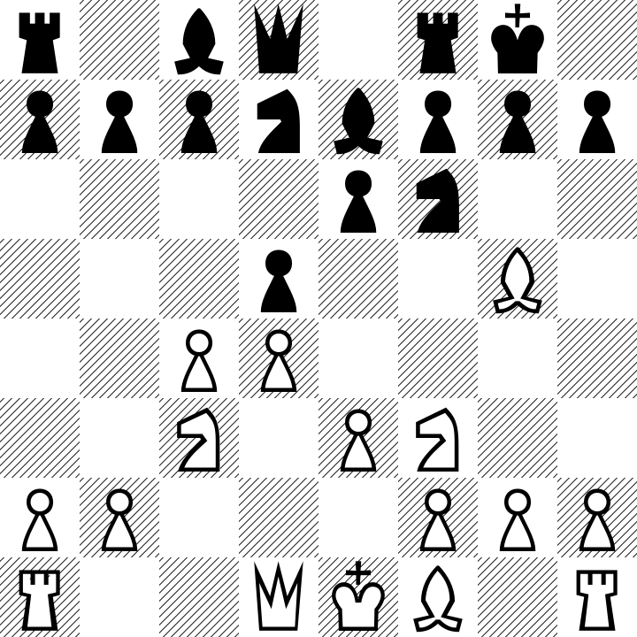

# FENwright: a FEN-to-Chessboard font

**Type any chess position in Forsyth-Edwards Notation, get a rendered board.** This is a font that uses OpenType features to turn a [FEN](https://en.wikipedia.org/wiki/Forsyth–Edwards_Notation)
placement string (everything before the first space) into a fully visualized 8×8 chessboard diagram.

```
r1bq1rk1/pppnbppp/4pn2/3p2B1/2PP4/2N1PN2/PP3PPP/R2QKB1R
```



That picture is the string above — a Queen's Gambit Declined position — set in the
FENwright font, nothing else. Every square, every piece, the checkered tiling, and the
layout are produced entirely by the font's OpenType logic.

## See it live

**[Try the live demo →](https://philatype.github.io/fenwright/)** — type a FEN and watch the board render in your browser.

## The idea

FEN is a one-dimensional string. A chessboard is two-dimensional. FENwright
bridges that gap **inside the font file itself**, using nothing but the same
OpenType shaping features that normally handle ligatures and kerning:

- Each character maps to a glyph: `KQRBNP` are the white pieces, `kqrbnp` the
  black pieces, `1`–`8` are runs of empty squares, and `/` ends a rank.
- A contextual-alternates (`calt`) feature acts as a tiny **state machine**: it
  tracks which rank and file each glyph falls on and swaps in a variant shifted
  to the correct row and matched to the right square colour (light or dark).
- A `kern` adjustment rewinds the text cursor to the left edge after each rank,
  so the next row stacks underneath instead of running off to the right.

The result: a flat string resolves into a perfectly arranged board, and editing
the string re-renders the position live.

## Use it

```html
<style>
  @font-face {
    font-family: "FENwright";
    src: url("FENwright-Regular.woff2") format("woff2"),
         url("FENwright-Regular.woff")  format("woff"),
         url("FENwright-Regular.otf")   format("opentype");
  }
  .board {
    font-family: "FENwright";
    font-size: 320px;            /* one board = 1 em */
    font-feature-settings: "calt" 1, "kern" 1;
    white-space: pre;
  }
</style>

<div class="board">rnbqkbnr/pppppppp/8/8/8/8/PPPPPPPP/RNBQKBNR</div>
```

Just type the board-placement field of a FEN — the part before the first space.
The checkerboard tiling is built into the glyphs, so the position string is all
you need.

## License

FENwright is licensed under the [SIL Open Font License, Version 1.1](LICENSE).
You can use, embed, modify, and redistribute it freely — including in commercial
work — as long as it isn't sold on its own and stays under the OFL.
